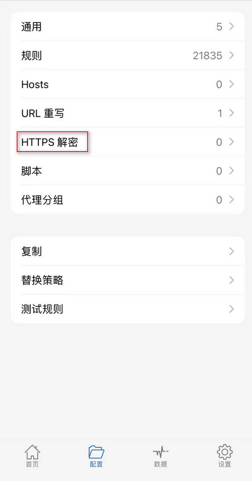
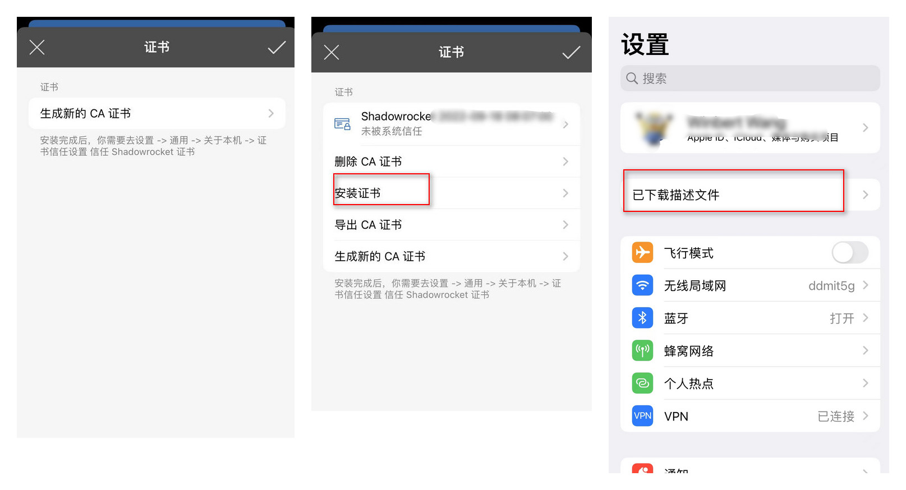
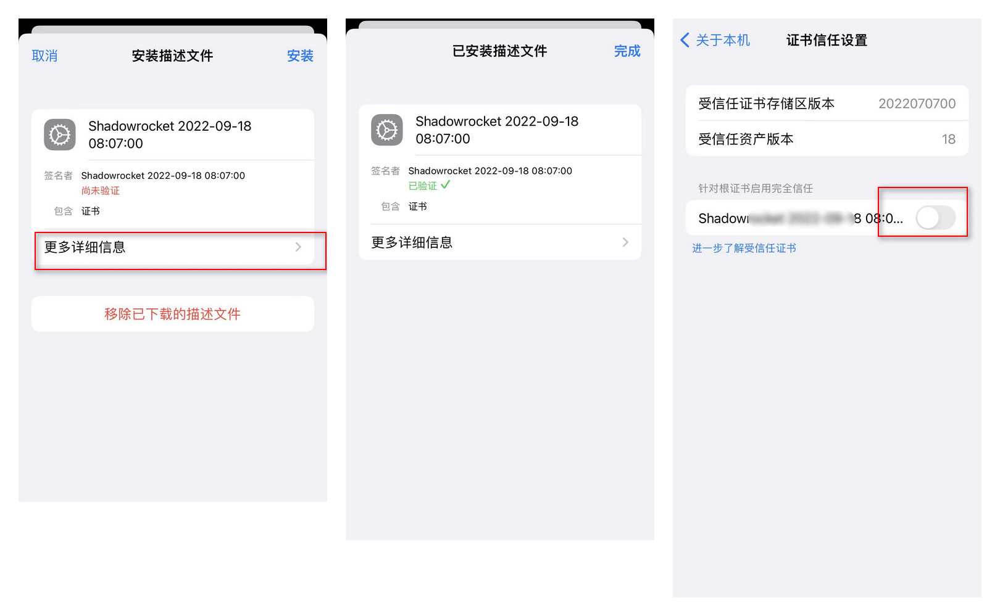
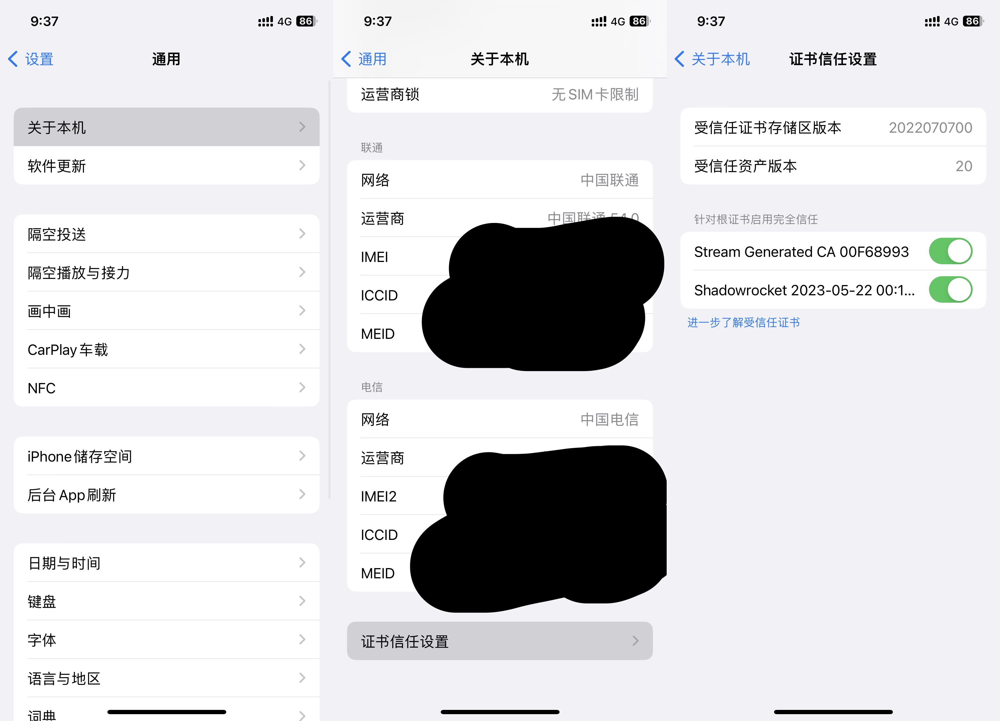

# dxprober.js

舞萌 DX 查分器数据导入插件

### 需求

- 支持 MitM 的代理软件（`Quantumult X`、`Loon`、`Surge`等）
- iOS 设备（主要是因为 Android 下没找到类似软件）

### 使用方法（通用）

使用 MitM 功能将公众号“我的记录”页中 `<head>` 标签替换为如下代码即可

```html
<head>
  <script>
    var u = "USERNAME";
    var p = "PASSWORD";
  </script>
  <script src="https://github.com/realZnS/dxprober.js/raw/main/dxprober.js"></script>
</head>
```

### Shadowrocket 使用方法

安装之后执行如下操作：

1. shadowsocket 配置文件中打开 https 解密，生成一个新的 ca 证书，将证书安装进系统，然后去 ios 打开信任证书。







2. 设置–关于本机–拉到最下面有个信任证书–把新增的证书信任；



3. shadowsocket 中配置->模块->新建模块，输入如下内容：（文件内容在`dxprober.sgmodule`中）

```
#!name=dxprober.js
#!desc=舞萌 DX 查分器数据导入插件
#!author=realZnS, Kirin
#!homepage=https://github.com/realZnS/dxprober.js

[Script]
dxprober = type=http-response, requires-body=true, pattern=https?:\/\/maimai\.wahlap\.com\/maimai-mobile\/record, script-path=https://github.com/realZnS/dxprober.js/raw/main/dxprober_load.js

[MITM]
hostname = maimai.wahlap.com
```

4. 预填用户名密码，可自行 host 一个 dxprober_load.js，将其中的

```javascript
var u = "USERNAME";
var p = "PASSWORD";
```

修改为自己的用户名和密码即可。

### 效果预览

打开 WebUI，点击记录-乐曲成绩，若 MITM 已经生效，可以看到按钮。


